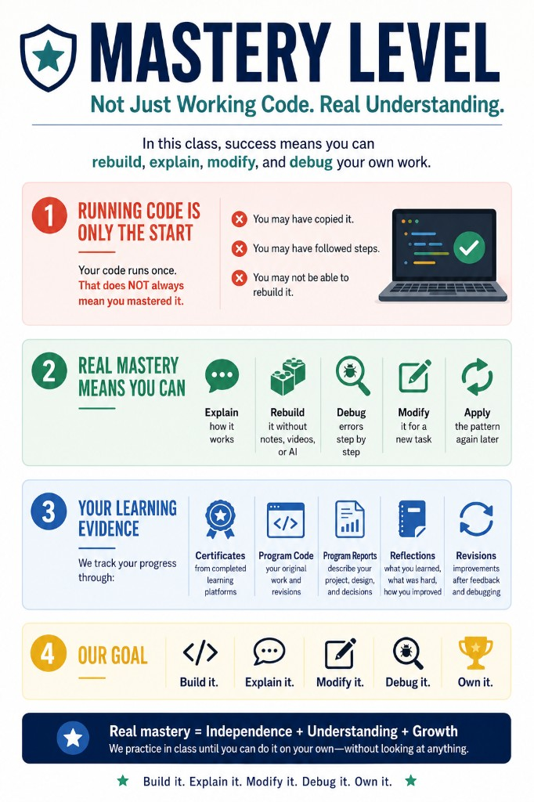

# How This Course Works

This course is **portfolio-first**, **evidence-based**, and **mastery-focused**.

---

## Three Places for Your Work

| Place | Role |
|---|---|
| **Course repository** (this repo) | Instructions, class missions, templates — read only |
| **Your GitHub repository** | **Learning evidence** — code, commits, reflections, certificates |
| **Your Notion portfolio** | Public **portfolio** — your best finished projects |

```text
Course repo tells you what to do.
Your GitHub shows how you learned.
Notion shows your best work to the world.
```

---

## What You Do Every Class

Open [today’s class mission](../02_Class_Missions/README.md) and follow the classroom flow:

1. **Skill Warm-up** — small task, not passive watching
2. **Talk Robin 1** — discuss with a partner
3. **Entry Check** — quick understanding check
4. **Core Pattern** — the idea you must learn today
5. **Guided Practice** — try it with support
6. **Independent Rebuild** — do it yourself without copying
7. **Talk Robin 2 + Evidence** — share and submit proof


Full details: [classroom-flow](../02_Class_Missions/shared/classroom-flow.md)

---

## Course Phases

```text
Phase 0   Git & GitHub
Phase 1   Notion Portfolio
Phase 2   AI Literacy
Phase 3   AI Math Bridge
Phase 4   Figma UI Design
Phase 5   TypeScript Basics
Phase 6   Next.js Frontend
Phase 7   FastAPI Backend
Phase 8   AI API + RAG Concepts
Phase 9   Full-Stack Integration
Phase 10  Cursor Capstone
Phase 11  Final Showcase — AI School Assistant
```

Phase requirements: [Phase Overviews](../09_Teacher_Planning/Phase_Overviews/) (your teacher will assign the file for each phase).

Study resources: [05_Resources/](../05_Resources/)

---

## What Counts as Success

**Not enough:** watching a video, copying code, or running something once.

**Required:** visible **learning evidence** — see [Evidence System](../04_Assessment/Evidence_System.md).

**Mastery** means you can **explain, rebuild, debug, modify, and apply** the core pattern.



Levels 0–5: [mastery-levels](../02_Class_Missions/shared/mastery-levels.md)

---

## Next Steps

1. [Set Up Your GitHub Repo](01_Set_Up_Your_GitHub_Repo.md)
2. [Set Up Your Notion Portfolio](02_Set_Up_Your_Notion_Portfolio.md) (after Phase 0)
3. Open [Phase 0 — Lesson 1](../02_Class_Missions/Phase_0_Git_GitHub/lesson-01-course-workflow-and-first-repo.md)

Back to [STUDENT_START_HERE.md](../STUDENT_START_HERE.md)
