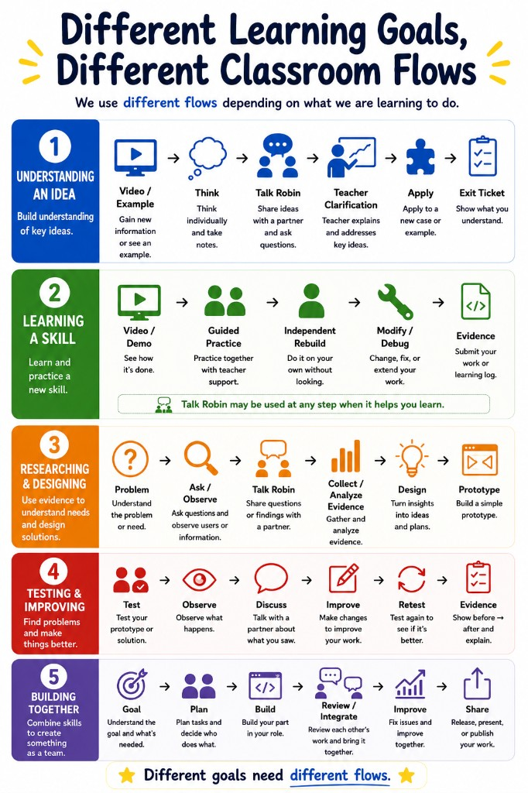

# Classroom Flow — What Happens Every Class

Each class follows the same **90-minute** structure. Know what you are doing in each block.

*Course poster: [classroom-flow.png](../../08_Public_Documents/posters/classroom-flow.png)*

> **Poster vs this guide:** The wall poster shows the learning cycle in seven steps. This guide adds **exact times** for a **90-minute class**, including **Group Answer** and **Entry Points Check**. Follow this guide during class.

---

## The Eight Blocks

| Time | Block | What you do |
|---|---|---|
| **0–15 min** | Self Learning / Skill Warm-up | Read, watch, or complete selected materials **independently** — write initial notes or answers |
| **15–25 min** | Talk Robin 1 | Discuss with partner or small group — **each student speaks** |
| **25–32 min** | Group Answer | Group prepares a short shared answer — what you understood, what you are unsure about, one question for the teacher |
| **32–42 min** | Entry Points Check | Teacher checks group answers to find what to explain next — **not mainly for grading** |
| **42–55 min** | Teacher Explanation / Core Pattern | Teacher explains **key unclear parts** — responds to confusion, does not reteach everything |
| **55–70 min** | Guided Practice | Complete the core workflow **with teacher support** |
| **70–83 min** | Independent Rebuild | **Repeat or rebuild** the pattern with less help — show you can reproduce it |
| **83–90 min** | Talk Robin 2 + Evidence | Explain what you did, compare evidence, submit **Exit Evidence** |

---

## Self Learning / Skill Warm-up (0–15 min) — Not Passive Time

You first learn **independently** through a selected video, guide, reading, or task.

**You may not** passively watch or skim.

You must produce **initial notes, answers, or observations** before Talk Robin 1.

---

## Talk Robin 1 (15–25 min)

Discuss your initial understanding with a partner or small group.

**Each student must speak.**

Compare answers. Identify what you understood, what you are unsure about, what confused you, and what question you want to ask the teacher.

See `talk-robin-rules.md`.

---

## Group Answer (25–32 min)

Each group prepares a **short shared answer** so student thinking is visible.

Typical contents (your mission guide may specify more):

- what the group understood
- what the group is still unsure about
- **one question for the teacher**

The teacher uses this during Entry Points Check.

---

## Entry Points Check (32–42 min)

**This is not a traditional quiz.** It is **not mainly for grading**.

The teacher checks group answers or asks quick questions to find **entry points for instruction**:

- what students already understand
- what students misunderstand
- what students still need explained

The teacher’s explanation should **respond to this**, not reteach everything from the video or guide.

---

## Teacher Explanation / Core Pattern (42–55 min)

Listen for **today’s core pattern**.

The teacher explains **only the key parts students need** — based on confusion and missing understanding from Entry Points Check.

**Do not expect** a full repeat of the Self Learning video or reading.

Write down the pattern. You will use it in Guided Practice and Independent Rebuild.

---

## Guided Practice (55–70 min)

Follow the core workflow **with teacher support**.

The teacher helps students who are stuck **after they tried something**.

---

## Independent Rebuild (70–83 min)

This is the most important block for **your mastery**.

**Repeat or rebuild** the same pattern with **less help**.

Running through steps once is **not enough**. You must show you can **reproduce the pattern independently** and **explain what you did**.

**You may not:**

- copy a full solution from a neighbor
- use AI to generate the full answer
- reuse yesterday’s finished work without a **new** meaningful change

**You may:**

- use a short checklist (if the mission guide allows)
- read error messages and try fixes
- ask the teacher **specific** questions after you tried something

---

## Talk Robin 2 + Evidence (83–90 min)

Explain what you did with your partner. Compare evidence.

Submit what the mission guide lists **before class ends** (or by your teacher’s deadline).

See `exit-evidence-checklist.md` for acceptable evidence types.

---

## Homework in This Course

There is **no heavy regular homework** if you finish class evidence.

If you do not finish **Independent Rebuild** or **Exit Evidence**, you may need to complete it later — that is not “optional extra work,” it is **unfinished class evidence**.
