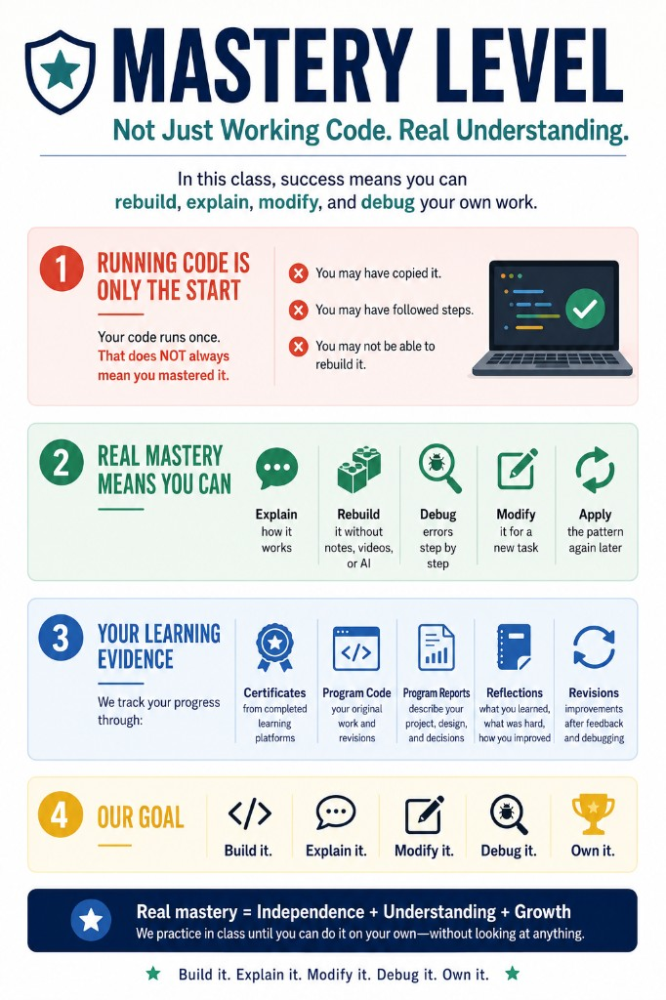

# Mastery Levels

Use these levels to describe **student independence**, not “finished the video.”

*Poster: [05_Public_Documents/posters/mastery-level.png](../../05_Public_Documents/posters/mastery-level.png)*

---

## Level 0: Exposure

The student has seen the concept through a short video, reading, example, or teacher demonstration.

**Example:** Watched a GitHub intro clip but cannot create a repo alone.

**Not sufficient** for course credit by itself.

---

## Level 1: Copy and Run

The student can follow instructions, copy the example, and make it work.

**Example:** Teacher demos create repo → student repeats steps successfully.

---

## Level 2: Explain While Looking

The student can look at the code, command, or project and explain what the important parts do.

**Example:** Student opens Commits tab and explains what their last commit changed.

---

## Level 3: Rebuild with a Checklist

The student can recreate the same pattern using a short checklist, but **without copying the full solution**.

**Example:** Checklist says “create folder → notes.md → meaningful commit” — student completes without paste.

**Minimum target** for phase unit completion.

---

## Level 4: Rebuild Without Notes

The student can recreate the pattern from a blank file, blank page, or terminal **without** notes, tutorials, AI answers, or solution code.

**Example:** Teacher asks for a new lesson folder + notes — student does it cold.

---

## Level 5: Modify, Debug, and Transfer

The student can use the same pattern in a **new situation**, **modify** it, and **debug** common errors.

**Example:** Student fixes peer’s missing push, improves commit message, helps locate wrong folder.

---

## Course Expectation Reminders

- **Watching** is not mastery.
- **Copying** is not mastery.
- **Running once** is not mastery.
- **Understanding** is not the same as **writing or rebuilding**.
- **Debugging** is learning, not failure.
- **AI** supports thinking — does not replace it.
- **Oral explanation** may be required.
- **Evidence** must be visible on GitHub, logs, screenshots, or reflections.
